# 🐾 Pet Shop Application

<div align="center">


</div>

## 📋 Giới thiệu

Chào mừng bạn đến với ứng dụng Pet Shop! 🎉

Đây là ứng dụng web quản lý cửa hàng thú cưng hiện đại được phát triển bằng Spring Boot. Hệ thống của chúng tôi được thiết kế để mang lại trải nghiệm mua sắm trực tuyến tốt nhất cho những người yêu thú cưng.

### 🔑 Các vai trò trong hệ thống:

| Vai trò | Mô tả |
|---------|--------|
| 👤 Khách hàng (USER) | Người dùng cuối, thực hiện mua sắm và quản lý đơn hàng |
| 👨‍💼 Người giao hàng (SHIPPER) | Xác nhận đơn hàng và cập nhật trạng thái đơn hàng |
| 👨‍💼 Chủ cửa hàng (VENDOR) | Xử lý đơn hàng và hỗ trợ khách hàng |
| 👨‍💻 Quản trị viên (ADMIN) | Quản lý toàn bộ hệ thống và phân quyền |

## 📚 Hướng dẫn sử dụng chi tiết theo vai trò

### 🛍️ Khách hàng (USER)

<details>
<summary><b>📝 Xem hướng dẫn chi tiết cho khách hàng</b></summary>

#### 🔐 Đăng ký tài khoản
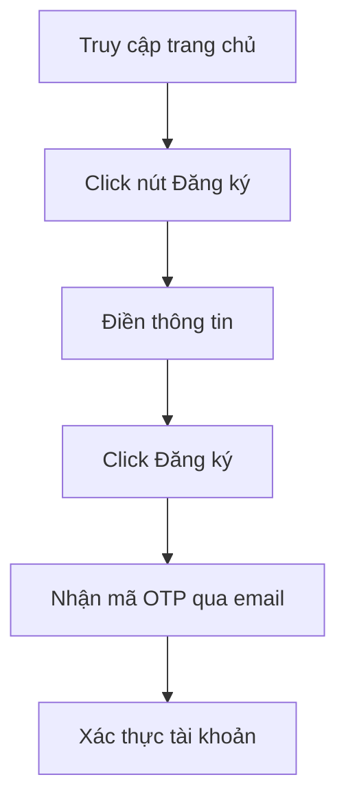

> 💡 **Thông tin cần điền:**
> - 👤 Họ và tên
> - 📧 Email (dùng để đăng nhập)
> - 📱 Số điện thoại
> - 🔒 Mật khẩu
> - 🔐 Xác nhận mật khẩu

#### 🔑 Đăng nhập

<div align="center">
<table>
<tr>
<th>Bước</th>
<th>Hành động</th>
</tr>
<tr>
<td>1️⃣</td>
<td>Click vào nút "Đăng nhập"</td>
</tr>
<tr>
<td>2️⃣</td>
<td>Nhập email và mật khẩu</td>
</tr>
<tr>
<td>3️⃣</td>
<td>Tùy chọn "Ghi nhớ đăng nhập"</td>
</tr>
<tr>
<td>4️⃣</td>
<td>Click "Đăng nhập"</td>
</tr>
</table>
</div>

#### 👤 Quản lý thông tin cá nhân
🔄 **Các thao tác chính:**

<div align="center">

| Tính năng | Mô tả | Icon |
|-----------|--------|------|
| Thông tin cơ bản | Cập nhật họ tên, số điện thoại, ngày sinh | 📝 |
| Đổi mật khẩu | Thay đổi mật khẩu đăng nhập | 🔒 |
| Cập nhật avatar | Tải lên ảnh đại diện mới | 🖼️ |
| Địa chỉ giao hàng | Thêm/sửa địa chỉ nhận hàng | 📍 |

</div>

#### 🛒 Mua sắm

<details>
<summary><b>🔍 Tìm kiếm sản phẩm</b></summary>

- 🏠 Lướt trang chủ
- 🔎 Sử dụng thanh tìm kiếm thông minh
- 📑 Lọc theo danh mục, lọc theo (bán chạy/yêu thích/đánh giá)
- ⚡ Sắp xếp linh hoạt (giá/tên/mới nhất)

</details>

<details>
<summary><b>📦 Xem chi tiết sản phẩm</b></summary>

- 🔍 Xem thông tin chi tiết
- 💰 Kiểm tra giá và khuyến mãi
- 📊 Xem số lượng còn trong kho
- ⭐ Đọc đánh giá từ khách hàng

</details>

<details>
<summary><b>🛍️ Thêm vào giỏ hàng</b></summary>

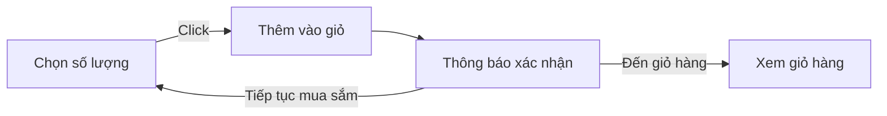

</details>

#### 🛒 Giỏ hàng

<div align="center">

| Chức năng | Thao tác | Icon |
|-----------|----------|------|
| Xem giỏ hàng | Danh sách sản phẩm đã chọn | 📋 |
| Cập nhật số lượng | Tăng/giảm số lượng sản phẩm | ⚖️ |
| Xóa sản phẩm | Loại bỏ sản phẩm khỏi giỏ | 🗑️ |
| Tính tổng tiền | Tự động tính tổng và khuyến mãi | 💰 |

</div>

#### 💳 Thanh toán

<div align="center">

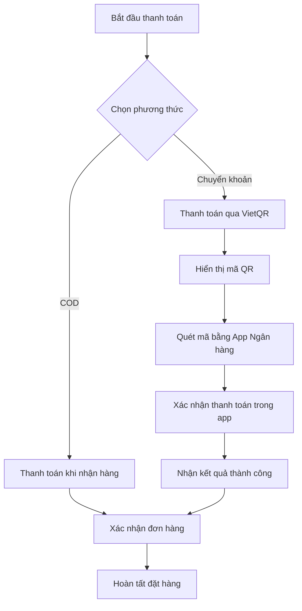

</div>

> 💡 **Lưu ý về thanh toán:**
> - 🏠 **COD**: Thanh toán khi nhận hàng tại địa chỉ
> - 💳 **VietQR**: Thanh toán bằng cách quét mã QR

#### 📦 Quản lý đơn hàng

<div align="center">

| Trạng thái | Mô tả | Icon |
|------------|-------|------|
| Chờ xác nhận | Đơn hàng mới tạo | ⏳ |
| Đang xử lý | Đang chuẩn bị hàng | 🔄 |
| Đang giao | Đang vận chuyển | 🚚 |
| Đã giao | Giao hàng thành công | ✅ |
| Đã hủy | Đơn hàng bị hủy | ❌ |

</div>

<details>
<summary><b>📋 Chi tiết đơn hàng</b></summary>

- 📝 Xem thông tin sản phẩm
- 🔍 Theo dõi trạng thái 
- 📅 Xem lịch sử giao hàng
- 💬 Nhắn tin với shop

</details>

<details>
<summary><b>❌ Hủy đơn hàng</b></summary>

> ⚠️ **Lưu ý**: Chỉ có thể hủy đơn khi:
> - 🕒 Đơn hàng chưa được xử lý
> - 📝 Có lý do hủy hợp lệ
> - ⏰ Trong thời gian cho phép

</details>

<details>
<summary><b>⭐ Đánh giá sản phẩm</b></summary>

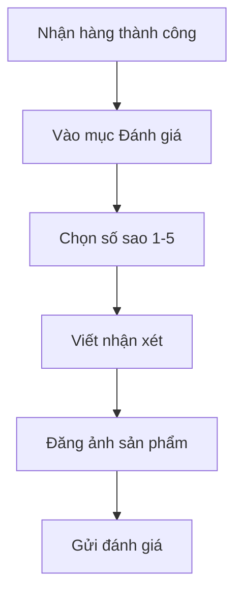

</details>

</details>

### 👨‍💻 Người giao hàng (SHIPPER)

<details>
<summary><b>🚚 Xem hướng dẫn chi tiết cho shipper</b></summary>

#### 🔐 Truy cập hệ thống

<div align="center">

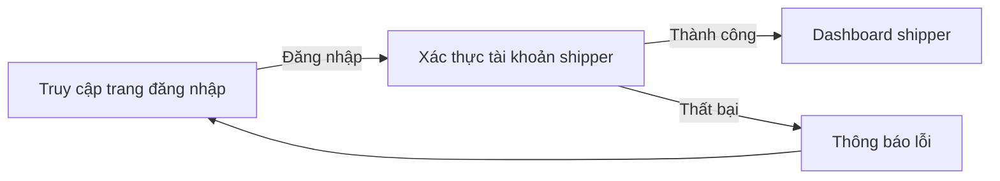

</div>

#### 📦 Quản lý đơn hàng được phân công

<div align="center">

| Tính năng | Icon | Mô tả |
|-----------|------|--------|
| Xem danh sách đơn | 📋 | Hiển thị đơn hàng được phân công giao |
| Tìm kiếm đơn | 🔍 | Tìm theo mã đơn, tên KH, địa chỉ |
| Lọc đơn hàng | ⚙️ | Lọc theo khu vực, trạng thái, ngày |
| Xác nhận nhận đơn | ✅ | Xác nhận đã nhận hàng để giao |
| Cập nhật trạng thái | 🔄 | Cập nhật tiến độ giao hàng |
| Hủy đơn hàng | ❌ | Hủy đơn không thể giao được |
| Xem chi tiết | 👁️ | Xem thông tin chi tiết đơn hàng |

</div>

<details>
<summary><b>📝 Quy trình xử lý đơn hàng</b></summary>

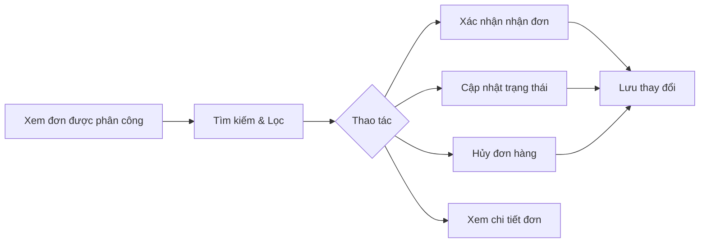

</details>

#### 🚚 Quy trình giao hàng chi tiết

<details>
<summary><b>🔄 Cập nhật trạng thái đơn hàng</b></summary>

<div align="center">

| Trạng thái | Icon | Mô tả | Hành động |
|------------|------|--------|-----------|
| Đã nhận hàng | 📥 | Đã nhận hàng từ kho | Xác nhận với hệ thống |
| Đang giao hàng | 🚚 | Đang trên đường giao | Cập nhật vị trí |
| Đã đến nơi | 📍 | Đã đến địa chỉ giao | Thông báo cho KH |
| Giao thành công | ✅ | Đã giao hàng thành công | Xác nhận hoàn tất |
| Giao thất bại | ❌ | Không giao được | Ghi rõ lý do |

</div>

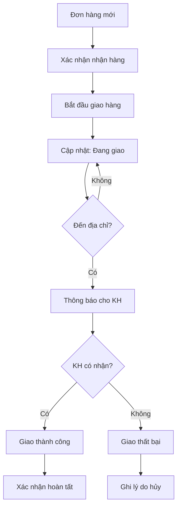

</details>

<details>
<summary><b>❌ Quy trình hủy đơn hàng</b></summary>

<div align="center">

| Lý do hủy | Mô tả | Yêu cầu bổ sung |
|-----------|-------|-----------------|
| Địa chỉ sai | Không tìm thấy địa chỉ | 📍 Chụp ảnh địa chỉ thực tế |
| KH không liên lạc | Không trả lời điện thoại | 📞 Ghi lại số lần gọi |
| KH từ chối | KH không nhận hàng | 📝 Lý do từ chối |
| Hàng hư hỏng | Sản phẩm bị vỡ/hỏng | 🖼️ Chụp ảnh minh chứng |
| Thời tiết | Thời tiết bất lợi | 🌧️ Ghi rõ điều kiện |

</div>

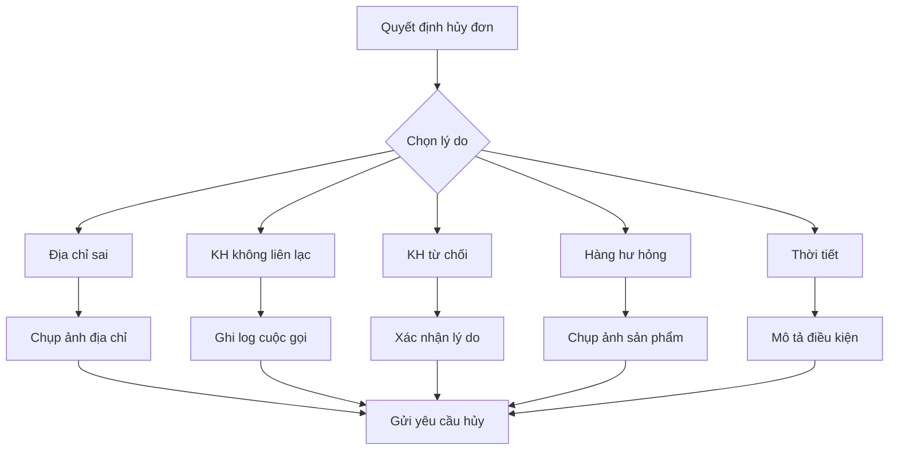

</details>

#### 📱 Tính năng hỗ trợ shipper

<details>
<summary><b>🗺️ Hỗ trợ định vị và điều hướng</b></summary>

<div align="center">

| Tính năng | Icon | Mô tả |
|-----------|------|--------|
| Xem bản đồ | 🗺️ | Hiển thị vị trí khách hàng trên bản đồ |
| Chỉ đường | 🧭 | Tích hợp Google Maps chỉ đường |
| Lộ trình tối ưu | ⚡ | Gợi ý lộ trình giao hàng hiệu quả |
| Đánh dấu đã giao | 📌 | Đánh dấu các điểm đã giao thành công |

</div>

</details>

<details>
<summary><b>📞 Liên hệ khách hàng</b></summary>

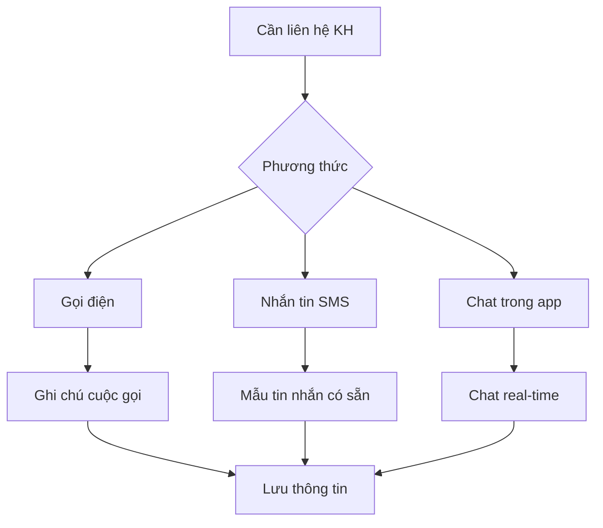

> 💡 **Mẫu tin nhắn tự động:**
> - "Tôi là shipper, đang đến giao đơn hàng [MÃ ĐƠN]"
> - "Tôi đã đến địa chỉ, xin gặp anh/chị để giao hàng"
> - "Không liên lạc được, tôi sẽ quay lại sau 30 phút"

</details>

#### 📊 Báo cáo và thống kê

<details>
<summary><b>📈 Hiệu suất giao hàng</b></summary>

<div align="center">

| Chỉ số | Mô tả | Mục tiêu |
|--------|-------|----------|
| Số đơn giao/ngày | Tổng số đơn đã giao | > 20 đơn |
| Tỷ lệ thành công | % đơn giao thành công | > 95% |
| Thời gian trung bình | Thời gian giao mỗi đơn | < 45 phút |
| Đánh giá KH | Điểm đánh giá từ KH | > 4.5/5 |

</div>

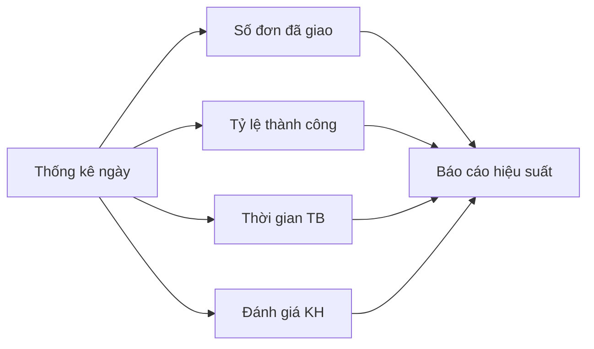

</details>

### 👨‍💼 Chủ cửa hàng (VENDOR)

<details>
<summary><b>📱 Xem hướng dẫn chi tiết cho chủ cửa hàng</b></summary>

#### 🔐 Truy cập hệ thống

<div align="center">

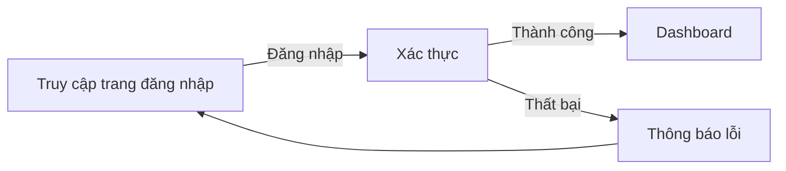

</div>

#### 📦 Quản lý đơn hàng
<div align="center">

| Chức năng | Thao tác | Mô tả |
|-----------|----------|--------|
| 📋 Xem danh sách | Lọc & Tìm kiếm | Quản lý đơn hàng theo trạng thái, mã đơn, ngày |
| ✅ Xác nhận đơn | Xử lý đơn mới | Kiểm tra và xác nhận thông tin đơn hàng |
| 🖨️ In hóa đơn | Xuất hóa đơn | Tạo hóa đơn PDF cho đơn hàng |
| 📝 Ghi chú | Thêm ghi chú | Cập nhật thông tin bổ sung cho đơn hàng |

</div>

#### 🚚 Quản lý giao hàng

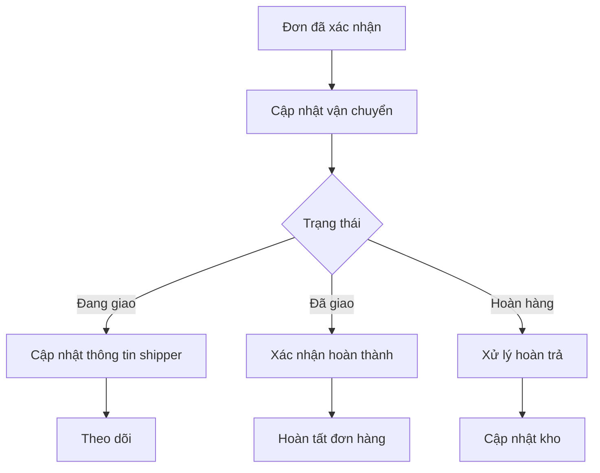

#### 📦 Quản lý sản phẩm

<div align="center">

| Tính năng | Icon | Mô tả |
|-----------|------|--------|
| Xem kho | 📊 | Kiểm tra tồn kho realtime |
| Lọc sản phẩm | 🔍 | Tìm kiếm theo danh mục |
| Cập nhật | ✏️ | Sửa thông tin sản phẩm |
| Hình ảnh | 🖼️ | Quản lý ảnh sản phẩm |

</div>

<details>
<summary><b>📝 Quy trình cập nhật sản phẩm</b></summary>

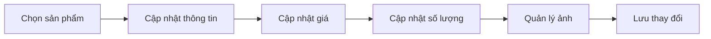

</details>

#### ⭐ Quản lý đánh giá

<div align="center">

| Tính năng | Icon | Mô tả |
|-----------|------|--------|
| Xem danh sách | 📝 | Hiển thị toàn bộ đánh giá từ khách hàng |
| Tìm kiếm | 🔍 | Tìm theo tên khách hàng/sản phẩm |
| Lọc thời gian | 📅 | Lọc đánh giá theo khoảng thời gian |
| Tải file | 📁 | Tải xuống ảnh/video đính kèm |
| Xóa đánh giá | 🗑️ | Xóa đánh giá không phù hợp |

</div>

<details>
<summary><b>📝 Quy trình quản lý đánh giá</b></summary>

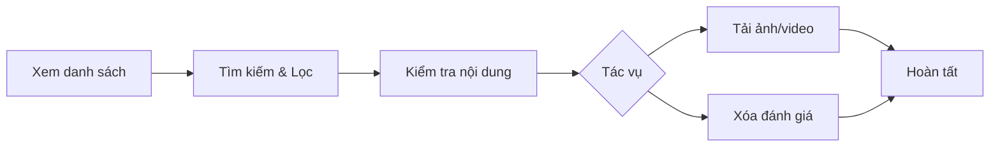

</details>

#### 🎯 Quản lý khuyến mãi

<div align="center">

| Tính năng | Icon | Mô tả |
|-----------|------|--------|
| Xem danh sách | 📋 | Hiển thị tất cả chương trình khuyến mãi |
| Thêm mới | ➕ | Tạo chương trình khuyến mãi mới |
| Chỉnh sửa | ✏️ | Cập nhật thông tin khuyến mãi |
| Xóa | 🗑️ | Xóa chương trình khuyến mãi |
| Tìm kiếm | 🔍 | Tìm theo mã khuyến mãi |
| Lọc | 📊 | Lọc theo trạng thái, ngày áp dụng |
| Nhập Excel | 📥 | Import danh sách khuyến mãi |
| Xuất Excel | 📤 | Export dữ liệu ra file Excel |

</div>

<details>
<summary><b>📝 Quy trình quản lý khuyến mãi</b></summary>

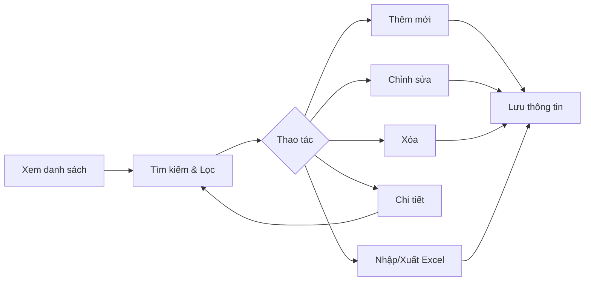

</details>

#### 📊 Lịch sử bán hàng

<div align="center">

| Tính năng | Icon | Mô tả |
|-----------|------|--------|
| Xem danh sách | 📋 | Hiển thị tất cả đơn hàng đã bán |
| Xuất Excel | 📤 | Export lịch sử đơn hàng ra file Excel |
| Theo dõi doanh thu | 💰 | Thống kê doanh thu theo thời gian thực |
| Tìm kiếm | 🔍 | Tìm kiếm đơn hàng theo mã, tên KH |
| Lọc | ⚙️ | Lọc theo trạng thái, ngày tạo, khoảng giá |

</div>

<details>
<summary><b>📝 Quy trình quản lý lịch sử bán hàng</b></summary>

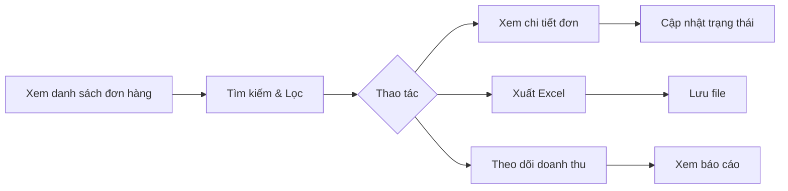

</details>

#### 💬 Hỗ trợ khách hàng
<div align="center">

| Nhiệm vụ | Thao tác | Trạng thái |
|----------|----------|------------|
| 📩 Tiếp nhận yêu cầu | Kiểm tra & phân loại | 🆕 Mới |
| 💬 Trả lời khách hàng | Chat trực tiếp/Email | 🔄 Đang xử lý |
| ✅ Xác nhận giải quyết | Cập nhật trạng thái | ✔️ Hoàn thành |

</div>

> 💡 **Mẹo hỗ trợ khách hàng:**
> - ⚡ Phản hồi nhanh trong 5 phút
> - 😊 Giao tiếp thân thiện, chuyên nghiệp
> - 📝 Ghi chú lại các vấn đề quan trọng
> - 📊 Theo dõi mức độ hài lòng

</details>

### 👨‍💻 Quản trị viên (ADMIN)

<details>
<summary><b>⚙️ Xem hướng dẫn chi tiết cho quản trị viên</b></summary>

#### 📊 Dashboard & Thống kê

<div align="center">

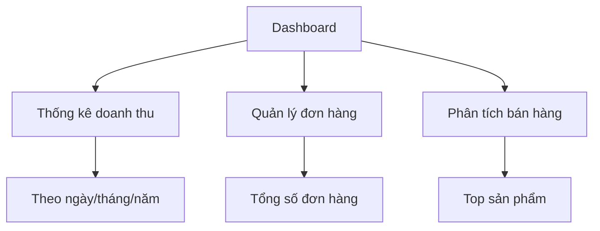

</div>

#### 📂 Quản lý danh mục

<div align="center">

| Tính năng | Icon | Mô tả |
|-----------|------|--------|
| Xem danh sách | 👁️ | Hiển thị tất cả danh mục sản phẩm |
| Thêm mới | ➕ | Tạo danh mục sản phẩm mới |
| Chỉnh sửa | ✏️ | Cập nhật thông tin danh mục |
| Xóa | 🗑️ | Xóa danh mục sản phẩm |
| Tìm kiếm | 🔍 | Tìm kiếm danh mục theo tên |

</div>

<details>
<summary><b>📝 Quy trình quản lý danh mục</b></summary>

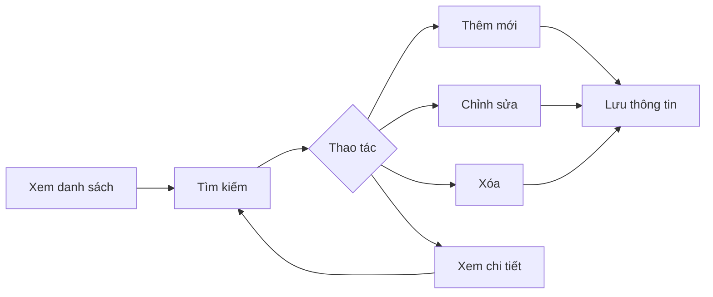

</details>

#### 🛍️ Quản lý sản phẩm (Toàn quyền)

<div align="center">

| Tính năng | Icon | Mô tả |
|-----------|------|--------|
| Xem danh sách | 👁️ | Hiển thị toàn bộ sản phẩm |
| Thêm mới | ➕ | Tạo sản phẩm hoàn toàn mới |
| Chỉnh sửa | ✏️ | Cập nhật mọi thông tin sản phẩm |
| Xóa | 🗑️ | Xóa vĩnh viễn sản phẩm |
| Tìm kiếm | 🔍 | Tìm theo tên, mã SKU |
| Lọc | ⚙️ | Lọc theo danh mục, trạng thái, kho |
| Nhập Excel | 📥 | Import hàng loạt từ file Excel |
| Xuất Excel | 📤 | Export dữ liệu sản phẩm ra Excel |

</div>

<details>
<summary><b>📝 Quy trình quản lý sản phẩm</b></summary>

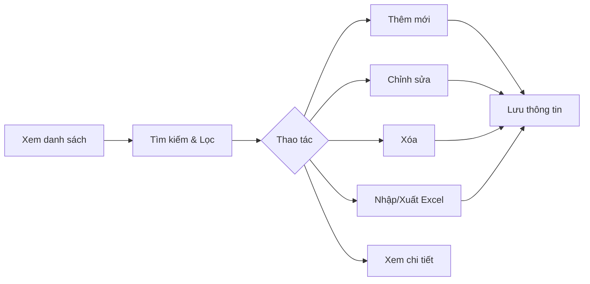

</details>

#### 👥 Quản lý người dùng

<div align="center">

| Tính năng | Icon | Mô tả |
|-----------|------|--------|
| Xem danh sách | 👁️ | Hiển thị toàn bộ người dùng |
| Thêm mới | ➕ | Tạo tài khoản người dùng mới |
| Chỉnh sửa | ✏️ | Cập nhật thông tin người dùng |
| Xóa | 🗑️ | Xóa tài khoản người dùng |
| Cấp quyền | 🔐 | Phân quyền truy cập hệ thống |
| Cập nhật trạng thái | 🔄 | Kích hoạt/Khóa tài khoản |
| Tìm kiếm | 🔍 | Tìm theo tên, email, SĐT |
| Lọc | ⚙️ | Lọc theo vai trò, trạng thái |
| Xuất Excel | 📤 | Export dữ liệu người dùng |

</div>

<details>
<summary><b>📝 Quy trình quản lý người dùng</b></summary>

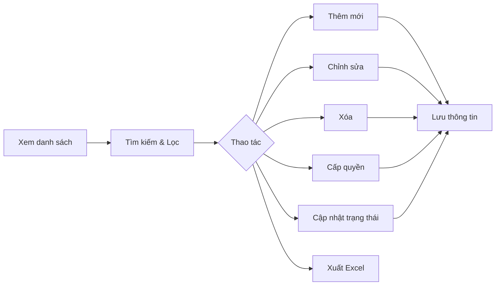

</details>

<details>
<summary><b>👤 Quản lý khách hàng</b></summary>

<div align="center">

| Chức năng | Mô tả chi tiết | Trạng thái |
|-----------|----------------|------------|
| **Thông tin tài khoản** | Xem & chỉnh sửa profile, lịch sử mua hàng | Đang hoạt động |
| **Quản lý trạng thái** | Kích hoạt/Khóa tài khoản vi phạm | Đã khóa |
| **Lịch sử giao dịch** | Theo dõi đơn hàng, điểm tích lũy | Đang chờ xử lý |

</div>

</details>

#### 📦 Quản lý đơn hàng

<div align="center">

| Tính năng | Icon | Mô tả |
|-----------|------|--------|
| Xem danh sách | 📋 | Hiển thị tất cả đơn hàng theo phương thức thanh toán |
| Tìm kiếm | 🔍 | Tìm theo mã đơn, tên KH, SĐT |
| Lọc đơn hàng | ⚙️ | Lọc theo trạng thái, ngày tạo, phương thức |
| Cập nhật trạng thái | 🔄 | Thay đổi trạng thái đơn hàng |
| Theo dõi đơn hàng | 📱 | Xem lịch sử cập nhật và vị trí |
| Xem chi tiết | 👁️ | Xem thông tin chi tiết đơn hàng |

</div>

<details>
<summary><b>📝 Quy trình quản lý đơn hàng</b></summary>

```mermaid
graph LR
    A[Xem danh sách đơn hàng] --> B[Lọc theo PT thanh toán]
    B --> C{COD}
    B --> D{VietQR}
    C --> E[Tìm kiếm & Lọc]
    D --> E
    E --> F{Thao tác}
    F --> G[Cập nhật trạng thái]
    F --> H[Theo dõi đơn]
    F --> I[Xem chi tiết]
    G --> J[Lưu thay đổi]
    H --> K[Hiển thị lộ trình]
```

</details>

<details>
<summary><b>💰 Phân loại theo phương thức thanh toán</b></summary>

<div align="center">

| Phương thức | Icon | Trạng thái phổ biến | Xử lý |
|-------------|------|---------------------|--------|
| **COD** | 📦 | Chờ xác nhận, Đang giao, Thành công | Cập nhật trạng thái giao hàng |
| **VietQR** | 💳 | Chờ thanh toán, Đã thanh toán, Đang giao | Xác nhận thanh toán tự động |

</div>

</details>

<details>
<summary><b>🔄 Vòng đời đơn hàng</b></summary>

```mermaid
graph TD
    A[Đơn hàng mới] --> B{Xác nhận PT thanh toán}
    B -->|COD| C[Chờ xác nhận]
    B -->|VietQR| D[Chờ thanh toán]
    D --> E[Đã thanh toán]
    C --> F[Đã xác nhận]
    E --> F
    F --> G[Đang đóng gói]
    G --> H[Đang giao hàng]
    H --> I[Giao thành công]
    H --> J[Giao thất bại]
    I --> K[Hoàn tất]
    J --> L[Đơn hủy]
```

#### ⭐ Quản lý đánh giá toàn hệ thống

<div align="center">

| Tính năng | Icon | Mô tả |
|-----------|------|--------|
| Xem danh sách | 📝 | Hiển thị tất cả đánh giá từ mọi cửa hàng |
| Tìm kiếm | 🔍 | Tìm theo tên KH, sản phẩm, cửa hàng |
| Lọc đa điều kiện | ⚙️ | Lọc theo cửa hàng, sao, thời gian |
| Tải file đính kèm | 📁 | Tải ảnh/video từ đánh giá |
| Ẩn/Hiện đánh giá | 👁️ | Kiểm duyệt nội dung hiển thị |
| Xóa đánh giá | 🗑️ | Xóa đánh giá vi phạm |
| Phản hồi đánh giá | 💬 | Phản hồi đánh giá từ quản trị |
| Xuất báo cáo | 📊 | Xuất Excel thống kê đánh giá |

</div>

<details>
<summary><b>📝 Quy trình quản lý đánh giá</b></summary>

```mermaid
graph LR
    A[Xem tất cả đánh giá] --> B[Lọc theo cửa hàng]
    B --> C[Tìm kiếm đa điều kiện]
    C --> D{Thao tác}
    D --> E[Kiểm duyệt nội dung]
    D --> F[Tải file đính kèm]
    D --> G[Phản hồi đánh giá]
    D --> H[Ẩn/Hiện đánh giá]
    D --> I[Xóa đánh giá]
    D --> J[Xuất báo cáo]
    E --> K[Lưu thay đổi]
    F --> K
    G --> K
    H --> K
    I --> K
    J --> K
```

</details>

<details>
<summary><b>🏪 Phân loại theo cửa hàng</b></summary>

<div align="center">

| Tiêu chí | Mô tả | Thao tác |
|----------|-------|----------|
| **Lọc cửa hàng** | Chọn 1 hoặc nhiều cửa hàng | Dropdown đa chọn |
| **Đánh giá theo sao** | 1-5 sao, có thể lọc theo khoảng | ⭐⭐⭐⭐⭐ |
| **Trạng thái hiển thị** | Đang hiển thị, Đã ẩn | Badge màu |
| **Thời gian** | Theo ngày, tuần, tháng, quý | Date picker |

</div>

</details>

<details>
<summary><b>🛡️ Quy trình kiểm duyệt</b></summary>

```mermaid
graph TD
    A[Đánh giá mới từ cửa hàng] --> B{Kiểm tra nội dung}
    B -->|Hợp lệ| C[Hiển thị công khai]
    B -->|Vi phạm| D[Ẩn hoặc xóa]
    C --> E[Gửi thông báo cho KH]
    D --> F[Lưu nhật ký kiểm duyệt]
```
#### 🚚 Quản lý vận chuyển

<div align="center">

| Tính năng | Icon | Mô tả |
|-----------|------|--------|
| Xem danh sách | 👁️ | Hiển thị tất cả dịch vụ vận chuyển |
| Thêm mới | ➕ | Thêm dịch vụ vận chuyển mới |
| Chỉnh sửa | ✏️ | Cập nhật thông tin vận chuyển |
| Xóa | 🗑️ | Xóa dịch vụ vận chuyển |
| Tìm kiếm | 🔍 | Tìm theo tên dịch vụ, nhà cung cấp |
| Sắp xếp | 📊 | Sắp xếp theo tên, phí vận chuyển |
| Xem chi tiết | 📋 | Xem thông tin chi tiết dịch vụ |

</div>

<details>
<summary><b>📝 Quy trình quản lý vận chuyển</b></summary>

```mermaid
graph LR
    A[Xem danh sách] --> B[Tìm kiếm]
    B --> C[Sắp xếp]
    C --> D{Thao tác}
    D --> E[Thêm mới]
    D --> F[Chỉnh sửa]
    D --> G[Xóa]
    D --> H[Xem chi tiết]
    E --> I[Lưu thông tin]
    F --> I
    G --> I
    H --> B
```

</details>

<details>
<summary><b>📦 Thông tin dịch vụ vận chuyển</b></summary>

<div align="center">

| Thông tin | Mô tả | Bắt buộc |
|-----------|-------|----------|
| **Tên dịch vụ** | Tên nhà vận chuyển (GHTK, GHN, Viettel Post...) | ✅ |
| **Phí vận chuyển** | Chi phí cho mỗi đơn hàng | ✅ |
| **Thời gian giao** | Số ngày dự kiến giao hàng | ✅ |
| **Khu vực áp dụng** | Phạm vi giao hàng (Toàn quốc/Từng khu vực) | ✅ |
| **Trạng thái** | Đang hoạt động/Tạm dừng | ✅ |
| **Mô tả** | Thông tin bổ sung về dịch vụ | ❌ |

</div>

</details>

<details>
<summary><b>💰 Sắp xếp theo chi phí</b></summary>

```mermaid
graph TD
    A[Danh sách vận chuyển] --> B{Sắp xếp theo}
    B --> C[Phí tăng dần]
    B --> D[Phí giảm dần]
    B --> E[Tên A-Z]
    B --> F[Tên Z-A]
    C --> G[Hiển thị kết quả]
    D --> G
    E --> G
    F --> G
```

## Yêu cầu hệ thống
- Java Development Kit (JDK) 8 trở lên
- Maven
- SQL Server
- IDE (khuyến nghị sử dụng Eclipse hoặc IntelliJ IDEA)

## Cài đặt và Chạy ứng dụng

### 1. Cấu hình Database
1. Tạo database trong SQL Server
2. Cập nhật thông tin kết nối database trong file `application.properties`:
   ```properties
   spring.datasource.url=jdbc:sqlserver://[YOUR_SERVER_NAME]:1433;databaseName=[YOUR_DATA]
   spring.datasource.username=sa
   spring.datasource.password=[YOUR_PASS]
   ```

### 2. Chạy ứng dụng
1. Clone repository về máy
2. Mở terminal/command prompt tại thư mục dự án
3. Chạy lệnh: `mvn spring-boot:run`
4. Truy cập ứng dụng tại: `http://localhost:8080`

## Các chức năng chính

### 1. Quản lý người dùng
- **Đăng ký tài khoản**: 
  - Truy cập `/register`
  - Điền thông tin cá nhân
  - Xác thực email thông qua mã OTP được gửi đến email đăng ký

- **Đăng nhập**: 
  - Truy cập `/login`
  - Đăng nhập bằng email và mật khẩu
  - Hệ thống sử dụng JWT token để xác thực

### 2. Quản lý sản phẩm
- Xem danh sách sản phẩm
- Tìm kiếm sản phẩm
- Lọc sản phẩm theo danh mục
- Xem chi tiết sản phẩm

### 3. Giỏ hàng và Đặt hàng
- Thêm sản phẩm vào giỏ hàng
- Cập nhật số lượng sản phẩm
- Xóa sản phẩm khỏi giỏ hàng
- Đặt hàng và chọn phương thức thanh toán

### 4. Thanh toán
#### Thanh toán qua VietQR
1. Chọn phương thức thanh toán VietQR
2. Xem chi tiết hóa đơn thanh toán
3. Được chuyển đến cổng thanh toán VietQR
4. Hoàn tất thanh toán và chờ redirect về trang callback

### 5. Quản lý đơn hàng
- Xem lịch sử đơn hàng
- Theo dõi trạng thái đơn hàng
- Hủy đơn hàng (nếu chưa xử lý)

### 6. Tính năng Admin
- Quản lý danh mục sản phẩm
- Quản lý sản phẩm (thêm, sửa, xóa)
- Quản lý đơn hàng
- Quản lý người dùng
- Quản lý đánh giá
- Quản lý vận chuyển
- Xem thống kê và báo cáo

### 7. Tính năng Vendor
- Quản lý sản phẩm (thêm, sửa, xóa)
- Quản lý đơn hàng
- Quản lý đánh giá
- Quản lý khuyến mãi
- Tương tác với người dùng
- Xem thống kê và báo cáo

### 8. Tính năng Shipper
- Xác nhận đơn hàng
- Cập nhật trạng thái đơn hàng
  
## Upload Files
- Hỗ trợ upload ảnh sản phẩm
- Giới hạn kích thước file: 10MB
- Đường dẫn lưu trữ ảnh: `uploads/images/`

## Cấu hình Email
Ứng dụng sử dụng Gmail SMTP để gửi email:
- Host: smtp.gmail.com
- Port: 587
- Yêu cầu xác thực: Có
- Sử dụng TLS: Có

## Xử lý lỗi thường gặp

### 1. Lỗi kết nối database
- Kiểm tra SQL Server đã chạy chưa
- Xác nhận thông tin kết nối trong application.properties
- Đảm bảo database DTA_PET đã được tạo

### 2. Lỗi thanh toán
- Kiểm tra cấu hình VNPay/MoMo trong application.properties
- Đảm bảo đường dẫn callback đúng
- Kiểm tra log để xem chi tiết lỗi

### 3. Lỗi upload file
- Kiểm tra thư mục uploads có tồn tại và có quyền ghi
- Đảm bảo kích thước file không vượt quá 10MB

## 🔄 Quy trình làm việc và bảo mật

### 📦 Quy trình xử lý đơn hàng

<div align="center">

```mermaid
stateDiagram-v2
    [*] --> NEW: Đặt hàng
    NEW --> CONFIRMED: Xác nhận
    CONFIRMED --> PROCESSING: Chuẩn bị
    PROCESSING --> SHIPPING: Giao hàng
    SHIPPING --> DELIVERED: Thành công
    SHIPPING --> FAILED: Thất bại
    DELIVERED --> COMPLETED: Xác nhận
    FAILED --> CANCELLED: Hủy đơn
```

</div>

<details>
<summary><b>📋 Chi tiết các trạng thái</b></summary>

| Trạng thái | Mô tả | Thao tác |
|------------|-------|----------|
| 🆕 NEW | Đơn hàng mới | Chờ xác nhận |
| ✅ CONFIRMED | Đã xác nhận | Chuẩn bị hàng |
| 🔄 PROCESSING | Đang xử lý | Đóng gói |
| 🚚 SHIPPING | Đang giao | Theo dõi |
| 📦 DELIVERED | Đã giao | Chờ xác nhận |
| ✨ COMPLETED | Hoàn tất | Đánh giá |
| ❌ FAILED | Giao thất bại | Xử lý lại |
| 🚫 CANCELLED | Đã hủy | Hoàn tiền |

</details>

> 💡 **Tự động hóa:**
> - 🔄 Tự động cập nhật kho
> - 📧 Gửi email thông báo
> - 📱 Push notification
> - 💰 Xử lý hoàn tiền

### 🔒 Bảo mật và quyền hạn

<details>
<summary><b>🛡️ Hệ thống bảo mật</b></summary>

<div align="center">

| Lớp bảo mật | Công nghệ | Mô tả |
|-------------|-----------|--------|
| 🔐 Xác thực | JWT + OAuth2 | Quản lý phiên đăng nhập |
| 🔒 Mã hóa | BCrypt | Bảo vệ mật khẩu |
| 🛡️ API | Spring Security | Kiểm soát truy cập |
| 📱 2FA | Google Auth | Xác thực 2 lớp |

</div>

</details>

<details>
<summary><b>🚦 Kiểm soát truy cập</b></summary>

```mermaid
graph TD
    A[Request] --> B{JWT Valid?}
    B -->|Yes| C{Role Check}
    B -->|No| D[Reject]
    C -->|Pass| E[Allow]
    C -->|Fail| D
```

#### 🔑 Phân quyền chi tiết

| Tài nguyên | Anonymous | User | Staff | Admin |
|------------|-----------|------|--------|--------|
| Xem sản phẩm | ✅ | ✅ | ✅ | ✅ |
| Đặt hàng | ❌ | ✅ | ✅ | ✅ |
| Quản lý đơn | ❌ | ⚡ | ✅ | ✅ |
| Cấu hình | ❌ | ❌ | ⚡ | ✅ |

> ✅ Được phép | ⚡ Hạn chế | ❌ Không được phép

</details>

#### 3.1. Xác thực và phân quyền
- Sử dụng JWT (JSON Web Token):
  - Token có hiệu lực 24 giờ
  - Refresh token có hiệu lực 7 ngày
  - Tự động gia hạn khi hoạt động
- Phân quyền chi tiết:
  - USER: Quyền cơ bản của khách hàng
  - STAFF: Quyền xử lý đơn và hỗ trợ
  - ADMIN: Toàn quyền quản trị hệ thống

#### 3.2. Bảo mật thông tin
- Mã hóa mật khẩu bằng BCrypt
- Mã hóa thông tin thanh toán
- HTTPS cho mọi giao tiếp
- Giới hạn số lần đăng nhập sai
- Xác thực 2 yếu tố cho admin

#### 3.3. Bảo vệ API
- CORS được cấu hình chặt chẽ
- Rate limiting cho API
- Validation cho mọi đầu vào
- Logging mọi hoạt động quan trọng

#### 3.4. Quy trình backup
- Backup database tự động mỗi ngày
- Backup hình ảnh định kỳ
- Lưu trữ log 30 ngày
- Khôi phục dữ liệu khi cần

### 4. Xử lý lỗi và sự cố

#### 4.1. Lỗi thanh toán
- Kiểm tra kết nối cổng thanh toán
- Xác nhận mã giao dịch
- Đối soát tự động
- Quy trình xử lý hoàn tiền

#### 4.2. Lỗi đơn hàng
- Kiểm tra tồn kho thời gian thực
- Xử lý conflict đặt hàng
- Cập nhật trạng thái tự động
- Thông báo cho khách hàng

### 🔧 Xử lý lỗi và sự cố

<details>
<summary><b>💳 Xử lý lỗi thanh toán</b></summary>

```mermaid
flowchart TD
    A[Lỗi thanh toán] --> B{Loại lỗi}
    B -->|Kết nối| C[Kiểm tra API]
    B -->|Giao dịch| D[Đối soát]
    B -->|Hoàn tiền| E[Xử lý hoàn trả]
    C --> F[Thử lại]
    D --> G[Xác nhận với cổng thanh toán]
    E --> H[Cập nhật trạng thái]
```

#### 🚨 Quy trình xử lý

1. **Kiểm tra ngay:**
   - 📡 Kết nối API
   - 🔍 Mã giao dịch
   - 💰 Số tiền

2. **Thông báo:**
   - 📱 SMS
   - 📧 Email
   - 🔔 App notification

3. **Giải quyết:**
   - ⚡ Thử lại giao dịch
   - 🔄 Chuyển phương thức khác
   - 💸 Xử lý hoàn tiền
</details>

<details>
<summary><b>🔍 Theo dõi hệ thống</b></summary>

<div align="center">

| Monitoring | Tools | Alert |
|------------|-------|-------|
| 📊 CPU/RAM | Grafana | > 80% |
| 💾 Disk | Prometheus | > 90% |
| 🌐 Network | Pingdom | < 95% |
| 🔐 Security | Wazuh | Real-time |

</div>

#### 🚀 Auto-scaling

```mermaid
graph TD
    A[Monitor Load] --> B{CPU > 80%?}
    B -->|Yes| C[Scale Up]
    B -->|No| D{CPU < 30%?}
    D -->|Yes| E[Scale Down]
    D -->|No| A
    C --> F[Add Instance]
    E --> G[Remove Instance]
    F --> A
    G --> A
```

#### ⚡ Failover Strategy

1. **Phát hiện:**
   - 🔍 Health check
   - ⏱️ Response time
   - 🎯 Error rate

2. **Xử lý:**
   - 🔄 Auto restart
   - 🔀 Load balancing
   - 🚀 Server rotation

3. **Khôi phục:**
   - 💾 Backup restore
   - 🔧 Config sync
   - 📊 Data validation

</details>

### 📞 Hỗ trợ và liên hệ

<div align="center">

| Kênh | Thông tin | Thời gian |
|------|-----------|-----------|
| 📧 Email | support@petshop.com | 24/7 |
| ☎️ Hotline | 1800-xxxx | 8AM-10PM |
| 💬 Live Chat | Website/App | 24/7 |
| 📱 Zalo | @petshop | 8AM-9PM |

</div>

> 💡 **Thời gian phản hồi:**
> - ⚡ Khẩn cấp: 15 phút
> - 🔄 Thông thường: 2 giờ
> - 📝 Góp ý: 24 giờ

---
<div align="center">

### 🌟 Cảm ơn bạn đã sử dụng Pet Shop! 🐾

</div>

## Hỗ trợ và liên hệ
Nếu có bất kỳ vấn đề hoặc câu hỏi nào, vui lòng liên hệ:
- Email: caongocthien1902@gmail.com
