# 🐾 Pet Shop Application

<div align="center">


</div>

## 📋 Giới thiệu

Chào mừng bạn đến với ứng dụng Pet Shop! 🎉

Đây là ứng dụng web quản lý cửa hàng thú cưng hiện đại được phát triển bằng Spring Boot. Hệ thống của chúng tôi được thiết kế để mang lại trải nghiệm mua sắm trực tuyến tốt nhất cho những người yêu thú cưng.

### 🔑 Các vai trò trong hệ thống:

| Vai trò | Mô tả |
|---------|--------|
| 👤 Khách hàng (USER) | Người dùng cuối, thực hiện mua sắm và quản lý đơn hàng |
| 👨‍💼 Nhân viên (STAFF) | Xử lý đơn hàng và hỗ trợ khách hàng |
| 👨‍💻 Quản trị viên (ADMIN) | Quản lý toàn bộ hệ thống và phân quyền |

## 📚 Hướng dẫn sử dụng chi tiết theo vai trò

### 🛍️ Khách hàng (USER)

<details>
<summary><b>📝 Xem hướng dẫn chi tiết cho khách hàng</b></summary>

#### 🔐 Đăng ký tài khoản
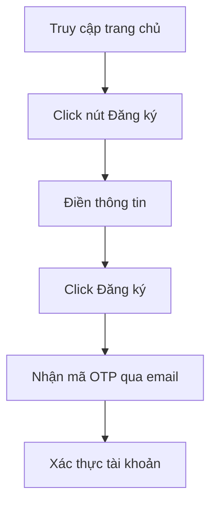

> 💡 **Thông tin cần điền:**
> - 👤 Họ và tên
> - 📧 Email (dùng để đăng nhập)
> - 📱 Số điện thoại
> - 🔒 Mật khẩu
> - 🔐 Xác nhận mật khẩu

#### 🔑 Đăng nhập

<div align="center">
<table>
<tr>
<th>Bước</th>
<th>Hành động</th>
</tr>
<tr>
<td>1️⃣</td>
<td>Click vào nút "Đăng nhập"</td>
</tr>
<tr>
<td>2️⃣</td>
<td>Nhập email và mật khẩu</td>
</tr>
<tr>
<td>3️⃣</td>
<td>Tùy chọn "Ghi nhớ đăng nhập"</td>
</tr>
<tr>
<td>4️⃣</td>
<td>Click "Đăng nhập"</td>
</tr>
</table>
</div>

#### 👤 Quản lý thông tin cá nhân
🔄 **Các thao tác chính:**

<div align="center">

| Tính năng | Mô tả | Icon |
|-----------|--------|------|
| Thông tin cơ bản | Cập nhật họ tên, số điện thoại, ngày sinh | 📝 |
| Đổi mật khẩu | Thay đổi mật khẩu đăng nhập | 🔒 |
| Cập nhật avatar | Tải lên ảnh đại diện mới | 🖼️ |
| Địa chỉ giao hàng | Thêm/sửa địa chỉ nhận hàng | 📍 |

</div>

#### 🛒 Mua sắm

<details>
<summary><b>🔍 Tìm kiếm sản phẩm</b></summary>

- 🏠 Lướt trang chủ
- 🔎 Sử dụng thanh tìm kiếm thông minh
- 📑 Lọc theo danh mục
- ⚡ Sắp xếp linh hoạt (giá/tên/mới nhất)

</details>

<details>
<summary><b>📦 Xem chi tiết sản phẩm</b></summary>

- 🔍 Xem thông tin chi tiết
- 💰 Kiểm tra giá và khuyến mãi
- 📊 Xem số lượng còn trong kho
- ⭐ Đọc đánh giá từ khách hàng

</details>

<details>
<summary><b>🛍️ Thêm vào giỏ hàng</b></summary>

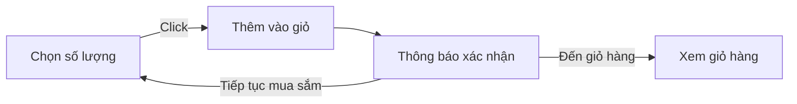

</details>

#### 🛒 Giỏ hàng

<div align="center">

| Chức năng | Thao tác | Icon |
|-----------|----------|------|
| Xem giỏ hàng | Danh sách sản phẩm đã chọn | 📋 |
| Cập nhật số lượng | Tăng/giảm số lượng sản phẩm | ⚖️ |
| Xóa sản phẩm | Loại bỏ sản phẩm khỏi giỏ | 🗑️ |
| Tính tổng tiền | Tự động tính tổng và khuyến mãi | 💰 |

</div>

#### 💳 Thanh toán

<div align="center">

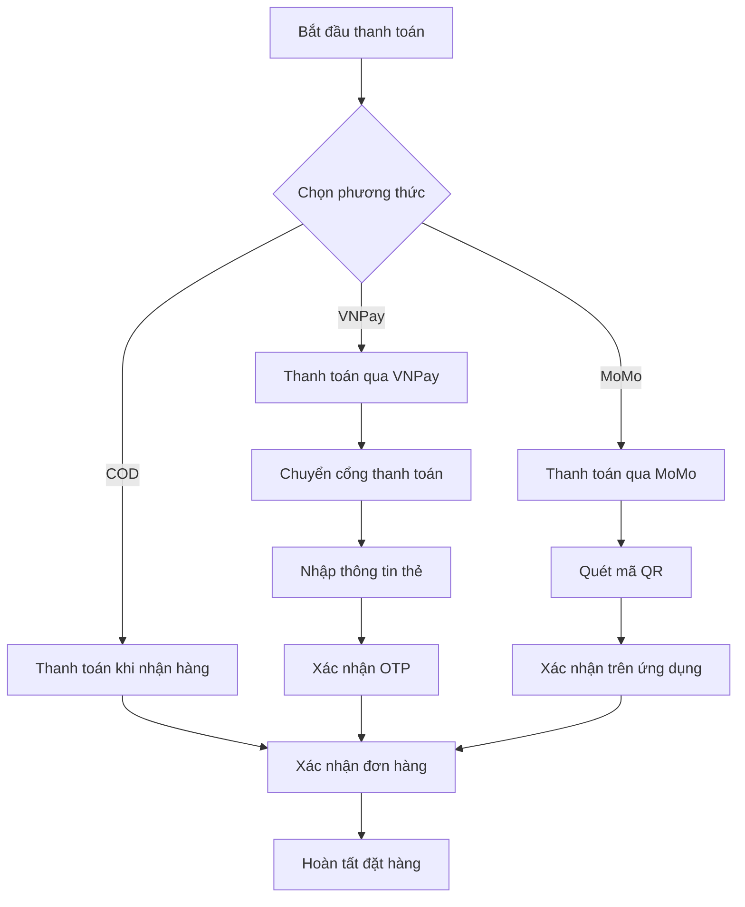

</div>

> 💡 **Lưu ý về thanh toán:**
> - 🏠 **COD**: Thanh toán khi nhận hàng tại địa chỉ
> - 💳 **VNPay**: Thanh toán bằng thẻ ATM/Credit Card
> - 📱 **MoMo**: Thanh toán qua ví điện tử MoMo

#### 📦 Quản lý đơn hàng

<div align="center">

| Trạng thái | Mô tả | Icon |
|------------|-------|------|
| Chờ xác nhận | Đơn hàng mới tạo | ⏳ |
| Đang xử lý | Đang chuẩn bị hàng | 🔄 |
| Đang giao | Đang vận chuyển | 🚚 |
| Đã giao | Giao hàng thành công | ✅ |
| Đã hủy | Đơn hàng bị hủy | ❌ |

</div>

<details>
<summary><b>📋 Chi tiết đơn hàng</b></summary>

- 📝 Xem thông tin sản phẩm
- 🔍 Theo dõi trạng thái realtime
- 📅 Xem lịch sử giao hàng
- 💬 Nhắn tin với shop

</details>

<details>
<summary><b>❌ Hủy đơn hàng</b></summary>

> ⚠️ **Lưu ý**: Chỉ có thể hủy đơn khi:
> - 🕒 Đơn hàng chưa được xử lý
> - 📝 Có lý do hủy hợp lệ
> - ⏰ Trong thời gian cho phép

</details>

<details>
<summary><b>⭐ Đánh giá sản phẩm</b></summary>

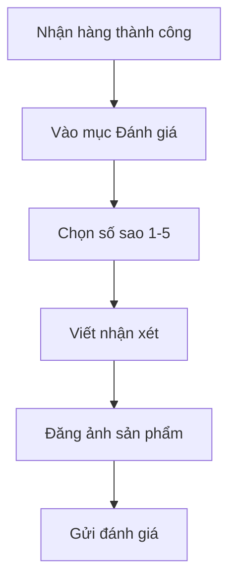

</details>

</details>

### 👨‍💼 Nhân viên (STAFF)

<details>
<summary><b>📱 Xem hướng dẫn chi tiết cho nhân viên</b></summary>

#### 🔐 Truy cập hệ thống

<div align="center">

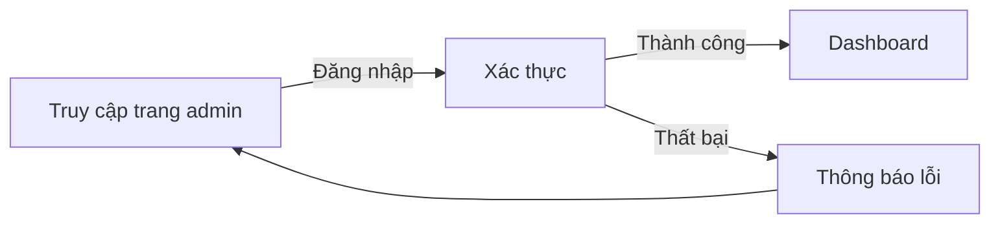

</div>

#### 📦 Quản lý đơn hàng
<div align="center">

| Chức năng | Thao tác | Mô tả |
|-----------|----------|--------|
| 📋 Xem danh sách | Lọc & Tìm kiếm | Quản lý đơn hàng theo trạng thái, mã đơn, ngày |
| ✅ Xác nhận đơn | Xử lý đơn mới | Kiểm tra và xác nhận thông tin đơn hàng |
| 🖨️ In hóa đơn | Xuất hóa đơn | Tạo hóa đơn PDF cho đơn hàng |
| 📝 Ghi chú | Thêm ghi chú | Cập nhật thông tin bổ sung cho đơn hàng |

</div>

#### 🚚 Quản lý giao hàng

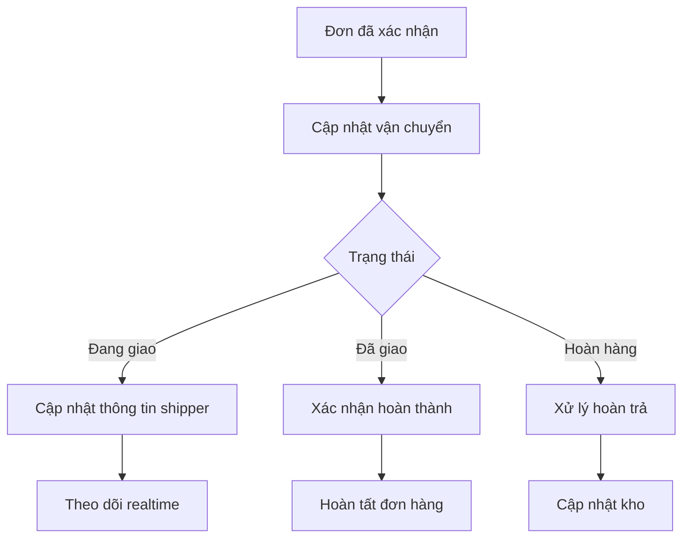

#### 📦 Quản lý sản phẩm

<div align="center">

| Tính năng | Icon | Mô tả |
|-----------|------|--------|
| Xem kho | 📊 | Kiểm tra tồn kho realtime |
| Lọc sản phẩm | 🔍 | Tìm kiếm theo danh mục |
| Cập nhật | ✏️ | Sửa thông tin sản phẩm |
| Hình ảnh | 🖼️ | Quản lý ảnh sản phẩm |

</div>

<details>
<summary><b>📝 Quy trình cập nhật sản phẩm</b></summary>

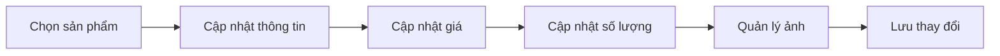

</details>

#### 💬 Hỗ trợ khách hàng
<div align="center">

| Nhiệm vụ | Thao tác | Trạng thái |
|----------|----------|------------|
| 📩 Tiếp nhận yêu cầu | Kiểm tra & phân loại | 🆕 Mới |
| 💬 Trả lời khách hàng | Chat trực tiếp/Email | 🔄 Đang xử lý |
| ✅ Xác nhận giải quyết | Cập nhật trạng thái | ✔️ Hoàn thành |

</div>

> 💡 **Mẹo hỗ trợ khách hàng:**
> - ⚡ Phản hồi nhanh trong 5 phút
> - 😊 Giao tiếp thân thiện, chuyên nghiệp
> - 📝 Ghi chú lại các vấn đề quan trọng
> - 📊 Theo dõi mức độ hài lòng

</details>

### 👨‍💻 Quản trị viên (ADMIN)

<details>
<summary><b>⚙️ Xem hướng dẫn chi tiết cho quản trị viên</b></summary>

#### 📊 Dashboard & Thống kê

<div align="center">

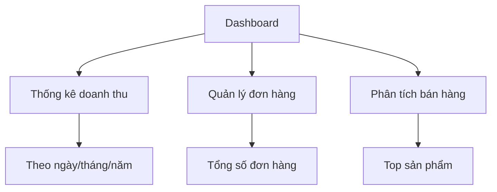

</div>

#### ⚙️ Cấu hình hệ thống

<div align="center">

| Cấu hình | Chức năng | Icon |
|----------|-----------|------|
| Thông tin shop | Cập nhật thông tin cửa hàng | 🏪 |
| Email | Cấu hình SMTP, mẫu email | 📧 |
| Thanh toán | Cài đặt VNPay, MoMo | 💳 |
| Giao diện | Quản lý banner, slider | 🎨 |

</div>

#### 📁 Quản lý danh mục

<div align="center">

| Chức năng | Mô tả | Thao tác nhanh |
|-----------|--------|----------------|
| ➕ Thêm mới | Tạo danh mục mới | `Alt + N` |
| 📝 Chỉnh sửa | Cập nhật thông tin | `Alt + E` |
| 🗑️ Xóa | Xóa danh mục | `Alt + D` |
| 📊 Sắp xếp | Điều chỉnh thứ tự | `Alt + S` |

</div>

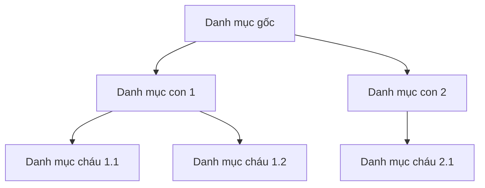

#### 🛍️ Quản lý sản phẩm (Full quyền)

<details>
<summary><b>✨ Thêm sản phẩm mới</b></summary>

<div align="center">

| Bước | Thông tin | Ghi chú |
|------|-----------|----------|
| 1️⃣ | Thông tin cơ bản | Tên, mã, danh mục |
| 2️⃣ | Giá & Khuyến mãi | Giá bán, giá KM |
| 3️⃣ | Hình ảnh | Tối đa 8 ảnh |
| 4️⃣ | SEO | Meta title, description |

</div>

</details>

<details>
<summary><b>📦 Quản lý kho</b></summary>

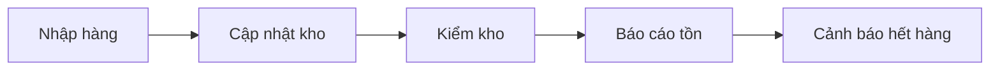

</details>

<details>
<summary><b>💰 Quản lý giá & Khuyến mãi</b></summary>

| Tính năng | Mô tả | Lịch trình |
|-----------|--------|------------|
| Giá cơ bản | Giá niêm yết | 24/7 |
| Flash Sale | Giảm giá sốc | Theo giờ |
| Combo | Mua nhiều giảm nhiều | Theo ngày |
| Mùa vụ | Khuyến mãi theo mùa | Theo tháng |

</details>

#### 👥 Quản lý người dùng

<details>
<summary><b>👤 Quản lý khách hàng</b></summary>

<div align="center">

| Chức năng | Thao tác | Phím tắt |
|-----------|----------|----------|
| 👀 Xem danh sách | Lọc & Tìm kiếm | `Ctrl + F` |
| 🔒 Khóa tài khoản | Tạm khóa/Vĩnh viễn | `Ctrl + L` |
| 🔑 Reset mật khẩu | Gửi email reset | `Ctrl + R` |
| 📊 Thống kê | Phân tích hành vi | `Ctrl + A` |

</div>

</details>

<details>
<summary><b>👨‍💼 Quản lý nhân viên</b></summary>

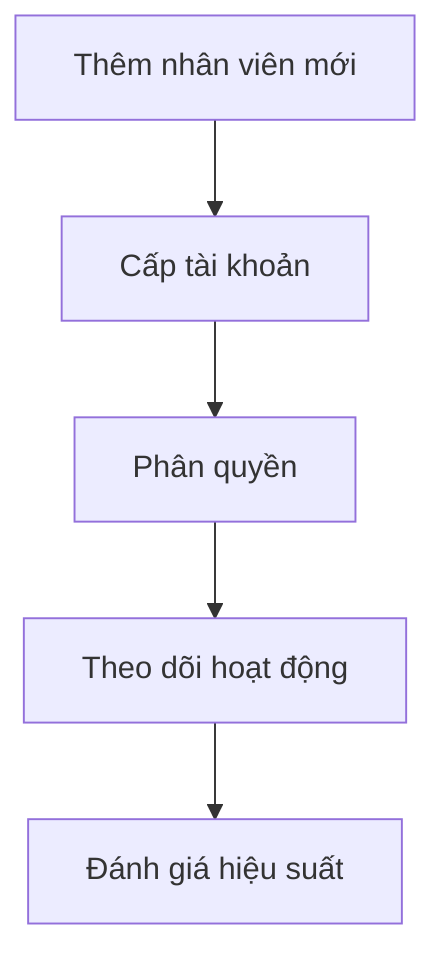

#### 🔐 Phân quyền chi tiết

| Module | STAFF | ADMIN |
|--------|-------|-------|
| Đơn hàng | ✅ | ✅ |
| Sản phẩm | ⚡ | ✅ |
| Khách hàng | ⚡ | ✅ |
| Tài chính | ❌ | ✅ |
| Cấu hình | ❌ | ✅ |

> ✅ Full quyền | ⚡ Hạn chế | ❌ Không có quyền

</details>

#### 💰 Quản lý tài chính

<div align="center">

| Báo cáo | Thời gian | Biểu đồ |
|---------|-----------|----------|
| 📈 Doanh thu | Ngày/Tuần/Tháng | Line chart |
| 📊 Sản phẩm | Top bán chạy | Bar chart |
| 💳 Thanh toán | Phương thức | Pie chart |
| 🔄 Hoàn tiền | Theo trạng thái | Status chart |

</div>

<details>
<summary><b>💹 Phân tích tài chính</b></summary>

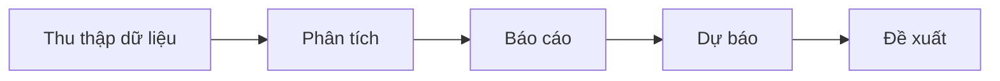

#### 📊 Các chỉ số quan trọng (KPIs)

| Chỉ số | Đơn vị | Xu hướng |
|--------|---------|----------|
| Doanh thu | VNĐ | 📈 |
| Lợi nhuận | % | 📊 |
| Đơn hàng | Số lượng | 📋 |
| Khách hàng | Tăng trưởng | 👥 |

</details>

</details>

## Yêu cầu hệ thống
- Java Development Kit (JDK) 8 trở lên
- Maven
- SQL Server
- IDE (khuyến nghị sử dụng Eclipse hoặc IntelliJ IDEA)

## Cài đặt và Chạy ứng dụng

### 1. Cấu hình Database
1. Tạo database `DTA_PET` trong SQL Server
2. Cập nhật thông tin kết nối database trong file `application.properties`:
   ```properties
   spring.datasource.url=jdbc:sqlserver://[YOUR_SERVER_NAME]:1433;databaseName=DTA_PET
   spring.datasource.username=sa
   spring.datasource.password=123456
   ```

### 2. Chạy ứng dụng
1. Clone repository về máy
2. Mở terminal/command prompt tại thư mục dự án
3. Chạy lệnh: `mvn spring-boot:run`
4. Truy cập ứng dụng tại: `http://localhost:8080`

## Các chức năng chính

### 1. Quản lý người dùng
- **Đăng ký tài khoản**: 
  - Truy cập `/register`
  - Điền thông tin cá nhân
  - Xác thực email thông qua mã OTP được gửi đến email đăng ký

- **Đăng nhập**: 
  - Truy cập `/login`
  - Đăng nhập bằng email và mật khẩu
  - Hệ thống sử dụng JWT token để xác thực

### 2. Quản lý sản phẩm
- Xem danh sách sản phẩm
- Tìm kiếm sản phẩm
- Lọc sản phẩm theo danh mục
- Xem chi tiết sản phẩm

### 3. Giỏ hàng và Đặt hàng
- Thêm sản phẩm vào giỏ hàng
- Cập nhật số lượng sản phẩm
- Xóa sản phẩm khỏi giỏ hàng
- Đặt hàng và chọn phương thức thanh toán

### 4. Thanh toán
#### Thanh toán qua VNPay
1. Chọn phương thức thanh toán VNPay
2. Điền thông tin thanh toán
3. Được chuyển đến cổng thanh toán VNPay
4. Hoàn tất thanh toán và chờ redirect về trang callback

#### Thanh toán qua MoMo
1. Chọn phương thức thanh toán MoMo
2. Quét mã QR hoặc sử dụng ứng dụng MoMo
3. Xác nhận thanh toán trên ứng dụng MoMo
4. Chờ callback để xác nhận trạng thái thanh toán

### 5. Quản lý đơn hàng
- Xem lịch sử đơn hàng
- Theo dõi trạng thái đơn hàng
- Hủy đơn hàng (nếu chưa xử lý)

### 6. Tính năng Admin
- Quản lý danh mục sản phẩm
- Quản lý sản phẩm (thêm, sửa, xóa)
- Quản lý đơn hàng
- Quản lý người dùng
- Xem thống kê và báo cáo

## Upload Files
- Hỗ trợ upload ảnh sản phẩm
- Giới hạn kích thước file: 10MB
- Đường dẫn lưu trữ ảnh: `uploads/images/`

## Cấu hình Email
Ứng dụng sử dụng Gmail SMTP để gửi email:
- Host: smtp.gmail.com
- Port: 587
- Yêu cầu xác thực: Có
- Sử dụng TLS: Có

## Xử lý lỗi thường gặp

### 1. Lỗi kết nối database
- Kiểm tra SQL Server đã chạy chưa
- Xác nhận thông tin kết nối trong application.properties
- Đảm bảo database DTA_PET đã được tạo

### 2. Lỗi thanh toán
- Kiểm tra cấu hình VNPay/MoMo trong application.properties
- Đảm bảo đường dẫn callback đúng
- Kiểm tra log để xem chi tiết lỗi

### 3. Lỗi upload file
- Kiểm tra thư mục uploads có tồn tại và có quyền ghi
- Đảm bảo kích thước file không vượt quá 10MB

## 🔄 Quy trình làm việc và bảo mật

### 📦 Quy trình xử lý đơn hàng

<div align="center">

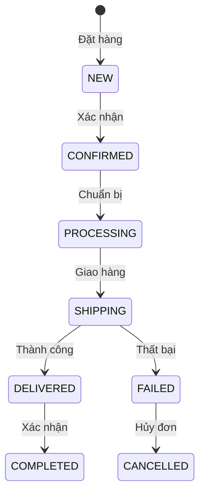

</div>

<details>
<summary><b>📋 Chi tiết các trạng thái</b></summary>

| Trạng thái | Mô tả | Thao tác |
|------------|-------|----------|
| 🆕 NEW | Đơn hàng mới | Chờ xác nhận |
| ✅ CONFIRMED | Đã xác nhận | Chuẩn bị hàng |
| 🔄 PROCESSING | Đang xử lý | Đóng gói |
| 🚚 SHIPPING | Đang giao | Theo dõi |
| 📦 DELIVERED | Đã giao | Chờ xác nhận |
| ✨ COMPLETED | Hoàn tất | Đánh giá |
| ❌ FAILED | Giao thất bại | Xử lý lại |
| 🚫 CANCELLED | Đã hủy | Hoàn tiền |

</details>

> 💡 **Tự động hóa:**
> - 🔄 Tự động cập nhật kho
> - 📧 Gửi email thông báo
> - 📱 Push notification
> - 💰 Xử lý hoàn tiền

### ⚠️ Quy trình xử lý khiếu nại

<div align="center">

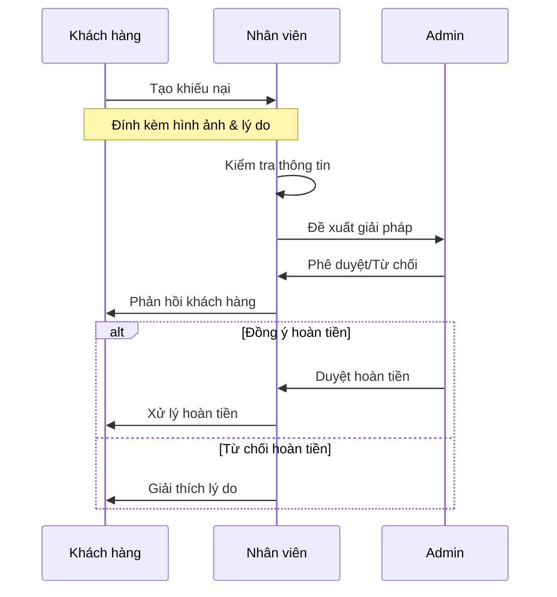

</div>

### 🔒 Bảo mật và quyền hạn

<details>
<summary><b>🛡️ Hệ thống bảo mật</b></summary>

<div align="center">

| Lớp bảo mật | Công nghệ | Mô tả |
|-------------|-----------|--------|
| 🔐 Xác thực | JWT + OAuth2 | Quản lý phiên đăng nhập |
| 🔒 Mã hóa | BCrypt | Bảo vệ mật khẩu |
| 🛡️ API | Spring Security | Kiểm soát truy cập |
| 📱 2FA | Google Auth | Xác thực 2 lớp |

</div>

</details>

<details>
<summary><b>🚦 Kiểm soát truy cập</b></summary>

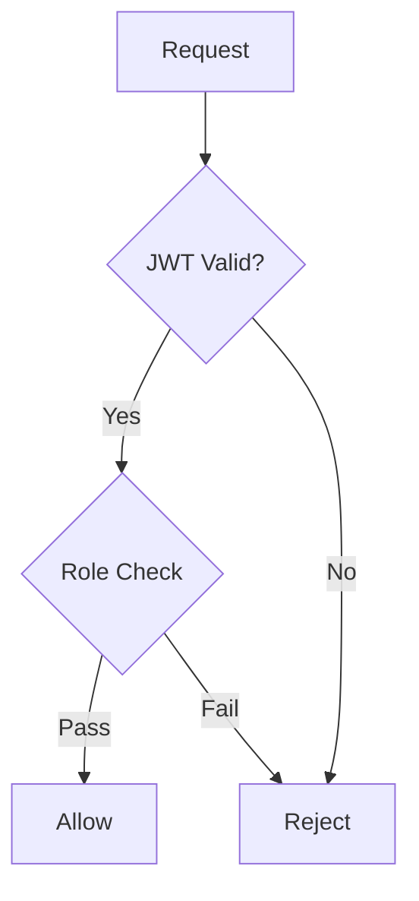

#### 🔑 Phân quyền chi tiết

| Tài nguyên | Anonymous | User | Staff | Admin |
|------------|-----------|------|--------|--------|
| Xem sản phẩm | ✅ | ✅ | ✅ | ✅ |
| Đặt hàng | ❌ | ✅ | ✅ | ✅ |
| Quản lý đơn | ❌ | ⚡ | ✅ | ✅ |
| Cấu hình | ❌ | ❌ | ⚡ | ✅ |

> ✅ Được phép | ⚡ Hạn chế | ❌ Không được phép

</details>

#### 3.1. Xác thực và phân quyền
- Sử dụng JWT (JSON Web Token):
  - Token có hiệu lực 24 giờ
  - Refresh token có hiệu lực 7 ngày
  - Tự động gia hạn khi hoạt động
- Phân quyền chi tiết:
  - USER: Quyền cơ bản của khách hàng
  - STAFF: Quyền xử lý đơn và hỗ trợ
  - ADMIN: Toàn quyền quản trị hệ thống

#### 3.2. Bảo mật thông tin
- Mã hóa mật khẩu bằng BCrypt
- Mã hóa thông tin thanh toán
- HTTPS cho mọi giao tiếp
- Giới hạn số lần đăng nhập sai
- Xác thực 2 yếu tố cho admin

#### 3.3. Bảo vệ API
- CORS được cấu hình chặt chẽ
- Rate limiting cho API
- Validation cho mọi đầu vào
- Logging mọi hoạt động quan trọng

#### 3.4. Quy trình backup
- Backup database tự động mỗi ngày
- Backup hình ảnh định kỳ
- Lưu trữ log 30 ngày
- Khôi phục dữ liệu khi cần

### 4. Xử lý lỗi và sự cố

#### 4.1. Lỗi thanh toán
- Kiểm tra kết nối cổng thanh toán
- Xác nhận mã giao dịch
- Đối soát tự động
- Quy trình xử lý hoàn tiền

#### 4.2. Lỗi đơn hàng
- Kiểm tra tồn kho thời gian thực
- Xử lý conflict đặt hàng
- Cập nhật trạng thái tự động
- Thông báo cho khách hàng

### 🔧 Xử lý lỗi và sự cố

<details>
<summary><b>💳 Xử lý lỗi thanh toán</b></summary>

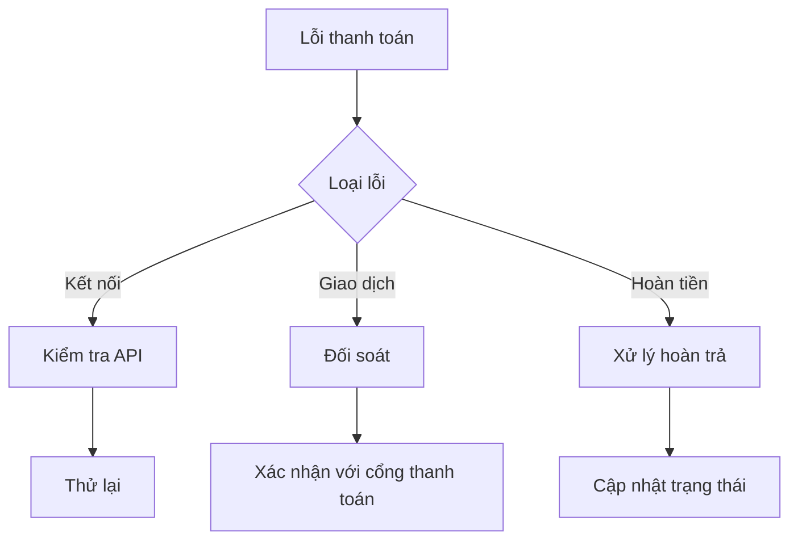

#### 🚨 Quy trình xử lý

1. **Kiểm tra ngay:**
   - 📡 Kết nối API
   - 🔍 Mã giao dịch
   - 💰 Số tiền

2. **Thông báo:**
   - 📱 SMS
   - 📧 Email
   - 🔔 App notification

3. **Giải quyết:**
   - ⚡ Thử lại giao dịch
   - 🔄 Chuyển phương thức khác
   - 💸 Xử lý hoàn tiền
</details>

<details>
<summary><b>🔍 Theo dõi hệ thống</b></summary>

<div align="center">

| Monitoring | Tools | Alert |
|------------|-------|-------|
| 📊 CPU/RAM | Grafana | > 80% |
| 💾 Disk | Prometheus | > 90% |
| 🌐 Network | Pingdom | < 95% |
| 🔐 Security | Wazuh | Real-time |

</div>

#### 🚀 Auto-scaling

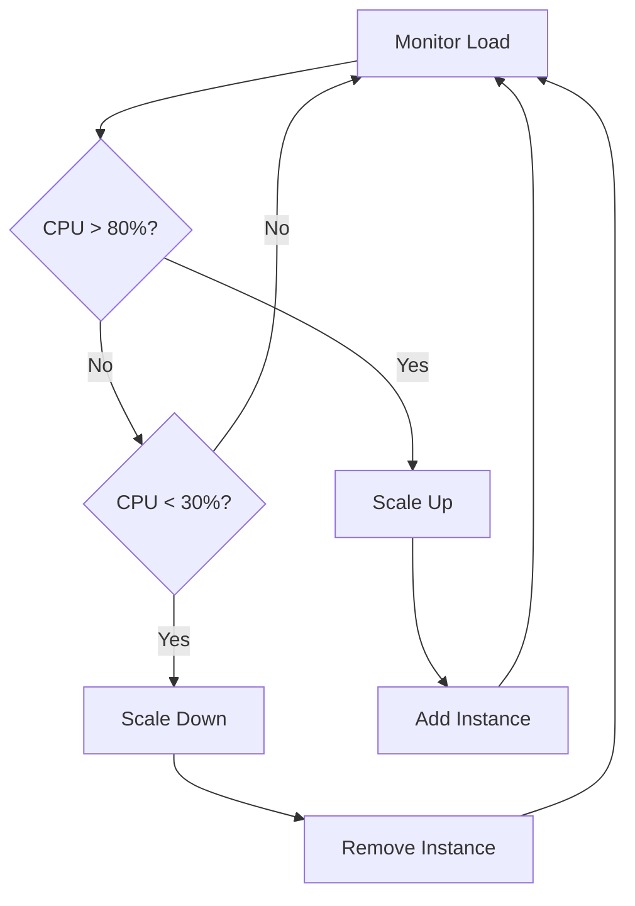

#### ⚡ Failover Strategy

1. **Phát hiện:**
   - 🔍 Health check
   - ⏱️ Response time
   - 🎯 Error rate

2. **Xử lý:**
   - 🔄 Auto restart
   - 🔀 Load balancing
   - 🚀 Server rotation

3. **Khôi phục:**
   - 💾 Backup restore
   - 🔧 Config sync
   - 📊 Data validation

</details>

### 📞 Hỗ trợ và liên hệ

<div align="center">

| Kênh | Thông tin | Thời gian |
|------|-----------|-----------|
| 📧 Email | support@petshop.com | 24/7 |
| ☎️ Hotline | 1800-xxxx | 8AM-10PM |
| 💬 Live Chat | Website/App | 24/7 |
| 📱 Zalo | @petshop | 8AM-9PM |

</div>

> 💡 **Thời gian phản hồi:**
> - ⚡ Khẩn cấp: 15 phút
> - 🔄 Thông thường: 2 giờ
> - 📝 Góp ý: 24 giờ

---
<div align="center">

### 🌟 Cảm ơn bạn đã sử dụng Pet Shop! 🐾

</div>

## Hỗ trợ và liên hệ
Nếu có bất kỳ vấn đề hoặc câu hỏi nào, vui lòng liên hệ:
- Email: caongocthien1902@gmail.com
